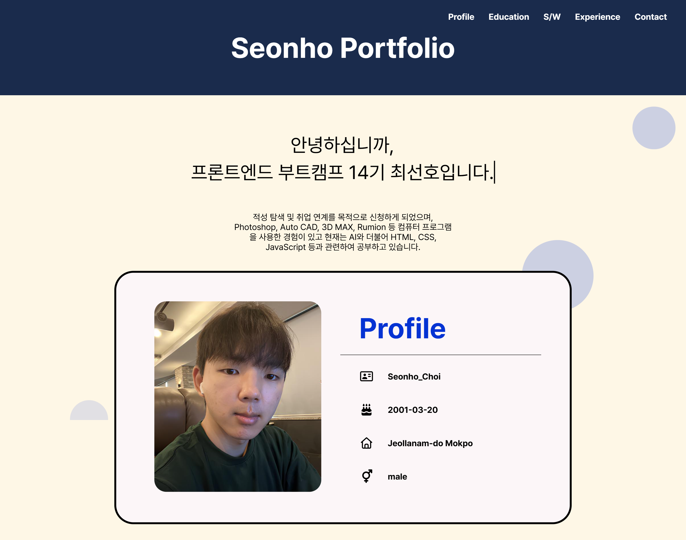

# 💻 최선호 개인 포트폴리오 웹사이트 (Seonho portfolio)

HTML과 CSS를 활용하여 제작한 반응형 포트폴리오 웹사이트입니다.

프론트엔드 부트캠프 과정 중 학습한 HTML과 CSS를 활용하여
자기소개, 학력, 강점 및 약점, 경험, 연락수단을 한 페이지에서
확인할 수 있도록 제작하였습니다.

## 🎥 프로젝트 미리보기



## 🔗 배포 주소

- Portfolio Website ： https://prefer3510-arch.github.io/resume2026/

## 📅 제작 기간

- 2026-05-29 ~ 2026-06-05

## 🛠️ 사용 기술

### Front-end

- HTML5
- CSS3

## 📁 프로젝트 구조

```text
resume2026/
├── index.html
├── css/
│   └── style.css
├── image/
│   ├── project_capture.png
│   └── 나무팜.png
└── README.md
```

## 🌐 주요 기능

### Navigation

- 클릭 시 각 섹션으로 이동 가능한 네비게이션 메뉴 구현

### Profile

- 기본 인적사항 및 자기소개 제공

### Education

- 학력 정보 소개

### Strength & Weakness

- 나의 강점 및 보완할 점 정리

### Experience

- 실제 경험 및 참여 내용 소개

### Contact

- Email, instarm, Github 링크 제공

### 반응형 포트폴리오 제공

- 모바일, 태블릿, 데스크탑에서 각각 다르게 보일 수 있도록 지원

---

## 🎯 프로젝트 목표

- 시맨틱 태그를 활용한 웹 문서 구조 설계
- CSS를 활용하여 레이아웃 구성 및 꾸미기
- 개인 포트폴리오에 들어갈 웹사이트 제작
- GitHub Page 배포 경험 습득

## 📖 배운 점

### HTML

- 시맨틱 태그를 활용한 전체적인 구조 설계
- tag / class / id 각각 어느 시점에 부여하는지 실습 적용

---

### CSS

- Flexbox를 활용한 레이아웃 구성
- 애니메이션 및 스타일링 적용

---

### Git & GitHub

- VSCODE에서 Git bash를 활용하여 GitHub로 작업물 배포
- Git commit, push 사용 및 취소 방법

---

## ❗트러블 슈팅

### 문제 상황

- profile 박스 안 상자 및 아이콘이 화면 축소 시 밀려서 튀어나감 (모바일)
- Experience에 삽입된 사진 2개가 방향 및 크기가 맞지 않음 (모바일, 태블릿, 데스크탑)
- contact의 아이콘 및 문구가 가로 일렬 정렬이 안되고 밀려서 내려감 (모바일)

### 해결 방법

- profile 박스에 flex-direction: column;을 주고 내부에 max-width와 margin을 주어 중앙 가로 정렬로 묶어서 해결
- 이미지에 flex: 1;과 고정 높이 부여 (데스크탑) / flex-direction: column으로 전환하고 이미지 너비 100% 부여 (모바일, 태블릿)
- 모바일에서 아이콘을 묶고 있던 클래스를 태블릿, 데스크탑의 선택자와 동일하게 수정

## 🙎‍♂️ 제작자

**최선호**

- Github : https://github.com/prefer3510-arch
